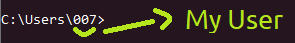

<h1>Speech</h1>

<h2><a href="https://StudioBahram.ir/apps/Python">Link if</a></h2>
<h2>Enter your text and hear the sound</h2>
<h1>Prerequisites</h1>
<pre>
<code>$ apt update  
$ apt install git python3 -y 
$ pip install gtts</code>
</pre>
 
<h1>Run on Linux</h1>
<pre>
<code>$ git clone https://github.com/Studio-Bahram/Speech  
$ cd Speech  
$ python3 Speech-lin.py</code>
</pre>
 
<h1>Run on Windows</h1>
<pre>
<code>$ git clone https://github.com/Studio-Bahram/Speech  
$ cd Speech  
$ python3 Speech-win.py</code>
</pre>

<pre><code># It is necessary to enter the device's Username to Save the file</code></pre>

<a href="https://StudioBahram.ir">Site</a>
&nbsp;&nbsp;&nbsp;&nbsp;
<a href="https://github.com/Studio-Bahram">Github</a>
&nbsp;&nbsp;&nbsp;&nbsp;
<a href="https://t.me/Studio_Bahram">Telegram</a>
&nbsp;&nbsp;&nbsp;&nbsp;
<a href="https://instagram.com/Studio_Bahram.ir">Instagram</a>
&nbsp;&nbsp;&nbsp;&nbsp;
<a href="https://youtube.com/channel/UCjc1xeBMu-mqXPSFSrzLEsg">YouTube</a>
&nbsp;&nbsp;&nbsp;&nbsp;
<a href="https://discord.gg/hGdFjAv">Discord</a>

